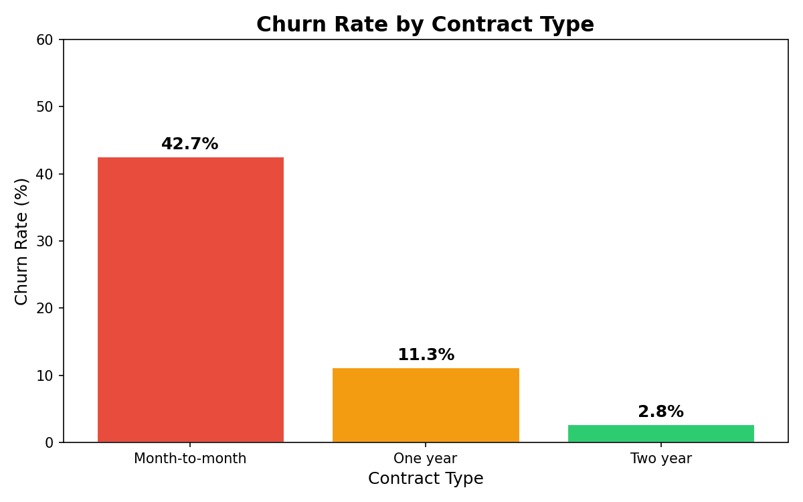
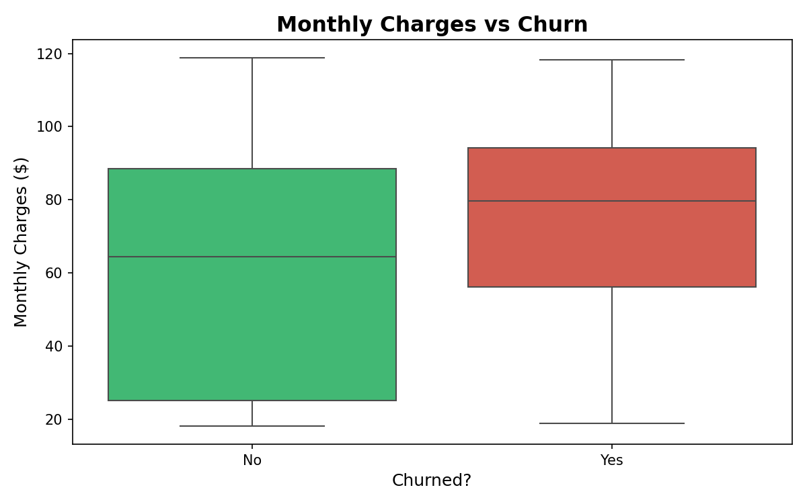
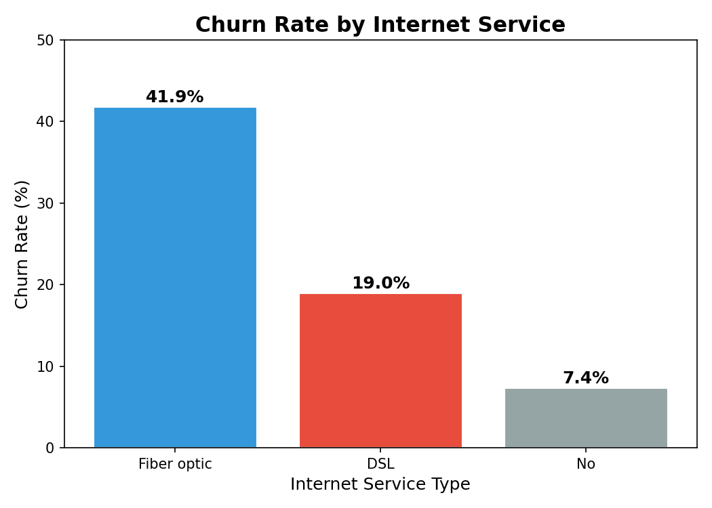
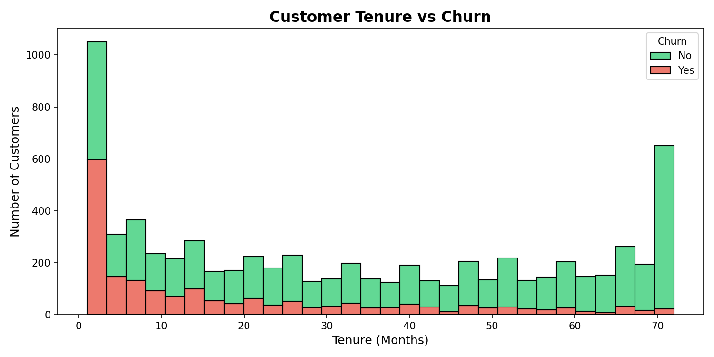

# 📡 Telecom Customer Churn Analysis


> Analyzing 7,000+ telecom customer records to identify churn patterns,
> high-risk segments, and actionable business retention strategies.

---

## 📋 Table of Contents
- [Overview](#overview)
- [Tools Used](#tools)
- [Business Problems](#business-problems)
- [Workflow](#workflow)
- [Key Insights](#key-insights)
- [Visualizations](#visualizations)
- [Power BI Dashboard](#power-bi-dashboard)
- [How to Run](#how-to-run)
- [What I Learned](#what-i-learned)

---

## 📌 Overview
This project analyzes a Telecom company's customer data to find **why customers 
churn** and which segments are at highest risk. The full workflow includes 
Python data cleaning, SQLite database queries, Matplotlib/Seaborn visualizations, 
and a Power BI interactive dashboard.

---

## 🗂️ Project Structure

customer-churn-analysis/

├── churn_analysis.ipynb # Main analysis notebook
├── churn.db # SQLite database
├── churn_by_contract.png # Chart 1
├── charges_vs_churn.png # Chart 2
├── churn_by_internet.png # Chart 3
├── tenure_vs_churn.png # Chart 4
├── powerbi_dashboard.png # Power BI Dashboard
├── .gitignore # Ignores CSV and DB files
└── README.md


---

## 🛠️ Tools & Technologies

| Tool | Purpose |
|---|---|
| Python | Data cleaning & automation |
| Pandas | DataFrame operations |
| Matplotlib / Seaborn | Data visualization |
| SQLite3 | SQL-based analysis |
| Power BI | Interactive dashboard |
| Jupyter Notebook | Exploratory analysis |

---

## 💡 Business Problems Solved
- 📉 What is the overall customer churn rate?
- 📋 Which contract type has the highest churn?
- 💸 Do higher monthly charges lead to more churn?
- 🌐 Which internet service type loses most customers?
- ⏱️ At what tenure point do customers most commonly leave?

---

## 🔄 Workflow
Raw CSV → Pandas Clean → SQLite DB → SQL Queries → Visualize → Power BI Dashboard

1. Load CSV + fix TotalCharges encoding issue
2. Drop nulls, create Churn_Flag (0/1)
3. Push cleaned data into SQLite database
4. Run SQL GROUP BY queries for segment analysis
5. Visualize with Matplotlib & Seaborn
6. Build Power BI dashboard with slicers

---

## 🔑 Key Insights
- 📌 Overall churn rate: **26.5%** of customers churned
- 📋 Month-to-month contracts had **42% churn** vs 11% for annual contracts
- 💸 Churned customers paid **$74/month avg** vs $61 for retained customers
- 🌐 Fiber optic internet had the **highest churn rate at 42%**
- ⏱️ Most churn happens in the **first 12 months** of customer lifecycle

---

## 📊 Visualizations

### Churn Rate by Contract Type

> 💡 Month-to-month customers churn 3x more than annual contract customers.

### Monthly Charges vs Churn

> 💡 Churned customers consistently paid higher monthly charges.

### Churn Rate by Internet Service

> 💡 Fiber optic users churn at 42% — highest of all service types.

### Tenure vs Churn

> 💡 Most churn happens in the first 12 months — early retention is critical.

---

## 📊 Power BI Dashboard

> Interactive dashboard with slicers for Contract Type and Internet Service.

---

## ▶️ How to Run
```bash
pip install pandas matplotlib seaborn jupyter openpyxl
jupyter notebook churn_analysis.ipynb
```
> Dataset: [Telco Customer Churn on Kaggle](https://www.kaggle.com/datasets/blastchar/telco-customer-churn)

---

## 🎓 What I Learned
- How to fix real-world data type issues (TotalCharges stored as string)
- How to load Pandas DataFrame into SQLite and run SQL queries
- How to identify high-risk business segments using GROUP BY
- How to build an interactive Power BI dashboard from Python-cleaned data
- How to translate data findings into actionable business recommendations

---

## 👤 Author
**Shivansh Garg** | B.Tech CSE (AI/ML) | GITAM, Haryana | 2027 Batch
🔗 [GitHub](https://github.com/shivanshgarg08)
🔗 [LinkedIn](https://www.linkedin.com/in/shivansh-garg-49ba00230/)


